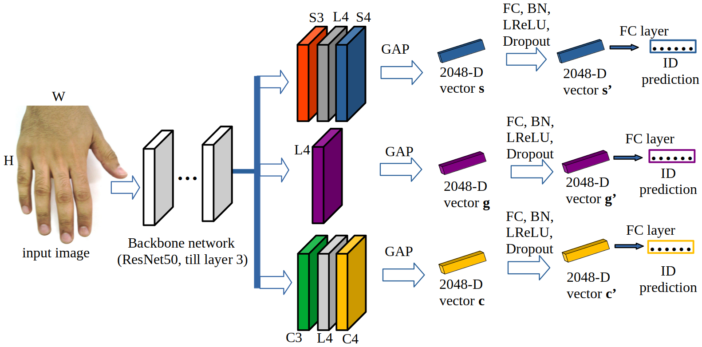

# Multi-Branch with Attention Network for Hand-Based Person Recognition

Code for the paper [Multi-Branch with Attention Network for Hand-Based Person Recognition](https://ieeexplore.ieee.org/document/9956555) which has been published on [ICPR 2022](https://iapr.org/archives/icpr2022/index.html).


## Overview
In this paper, we propose a novel hand-based person recognition method for the purpose of criminal investigations since the hand image is often the only available information in cases of serious crime such as sexual abuse. Our proposed method, Multi-Branch with Attention Network (MBA-Net), incorporates both channel and spatial attention modules in branches in addition to a global (without attention) branch to capture global structural information for discriminative feature learning. The attention modules focus on the relevant features of the hand image while suppressing the irrelevant backgrounds. In order to overcome the weakness of the attention mechanisms, equivariant to pixel shuffling, we integrate relative positional encodings into the spatial attention module to capture the spatial positions of pixels. Extensive evaluations on two large multi-ethnic and publicly available hand datasets demonstrate that our proposed method achieves state-of-the-art performance, surpassing the existing hand-based identification methods. 


The proposed attention modules and the structure of MBA-Net are shown below.

a) Channel Attention Module (CAM):


b) Spatial Attention Module with Relative Positional Encodings (SAM-RPE):


c) MBA-Net:




The qualitative results of our proposed method are also shown below. 


Some qualitative results of our method using query vs
ranked results retrieved from gallery are shown in the Fig. above. From top to bottom row
are HD, left palmar of 11k, right palmar of 11k, left dorsal
of 11k and right dorsal of 11k datasets. The green and red
bounding boxes denote the correct and the wrong matches,
respectively.


## Installation

Git clone this repo and install dependencies to have the same environment configuration as the one we used. Note that we trained all models on a single NVIDIA GeForce RTX 2080 Ti GPU.

```
git clone https://github.com/nathanlem1/MBA-Net.git
cd MBA-Net
pip install -r requirements.txt
```

## Data Preparation
We use [11k](https://sites.google.com/view/11khands) and [HD](http://www4.comp.polyu.edu.hk/~csajaykr/knuckleV2.htm) datasets for our experiments.

1. To use the [11k](https://sites.google.com/view/11khands) dataset, you neet to create `11k` folder under the `MBA-Net` folder. Download dataset to `/MBA-Net/11k/` from https://sites.google.com/view/11khands and extract it. You need to download both hand images and metadata (.csv file). The data structure will look like:

```
11k/
    Hands/
    HandInfo.csv
```
Then you can run following code to prepare the 11k dataset: 

```
python prepare_train_val_test_11k_r_l.py
```

2. To use the [HD](http://www4.comp.polyu.edu.hk/~csajaykr/knuckleV2.htm) dataset, you neet to create `HD` folder under the `MBA-Net` folder. Download dataset to `/MBA-Net/HD/` from http://www4.comp.polyu.edu.hk/~csajaykr/knuckleV2.htm and extract it. You need to download the original images. The data structure will look like:

```
HD/
   Original Images/
   Segmented Images/
   ReadMe.txt
```
Then you can run following code to prepare the HD dataset: 
```
python prepare_train_val_test_hd.py
```


## Train
To train on the 11k dorsal right dataset, you need to run the following code on terminal:  

```
python train.py --data_dir ./11k/train_val_test_split_dorsal_r --f_name ./model_11k_d_r --data_type 11k --m_name ResNet50_MBA
```

Please look into the `train.py` for more details. You need to provide the correct dataset i.e. right dorsal of 11k, left dorsal of 11k, right palmar of 11k, left palmar of 11k or HD dataset. 
You may need to change the name of `Original Images` in `HD/Original Images` to `Original_Images` so that it will look like `HD/Original_Images`. This helps to use it on command line to train the model on `HD` dataset.
Thus, to train on the HD dataset, you need to run the following code on terminal:

```
python train.py --data_dir ./HD/Original_Images/train_val_test_split --f_name ./model_HD --data_type HD --m_name ResNet50_MBA
```


## Evaluate
To evaluate, for instance, on the 11k dorsal right dataset, you need to run the following code on terminal:

```
python eval_query_gallery.py --test_dir ./11k/train_val_test_split_dorsal_r --f_name ./model_11k_d_r --m_name ResNet50_MBA
```

Please look into the `eval_query_gallery.py` for more details. In case you are using a command line, you can run on the HD dataset
after changing the name of `Original Images` in `HD/Original Images` to `Original_Images` so that it will look like `HD/Original_Images`, 
and then run the following code on terminal:

```
python eval_query_gallery.py --test_dir ./HD/Original_Images/train_val_test_split --f_name ./model_HD --m_name ResNet50_MBA
```

In addition, you can use `query_ranking_result_demo.py` to produce qualitative results.


## Citation

If you use this code for your research, please cite our paper.

```
@InProceedings{Nathanael_ICPR2022,
author = {Baisa, Nathanael L. and Williams, Bryan and Rahmani, Hossein and Angelov, Plamen and Black, Sue},
title = {Multi-Branch with Attention Network for Hand-Based Person Recognition},
booktitle = {The 26th International Conference on Pattern Recognition (ICPR)},
month = {Aug},
year = {2022}
}
```
